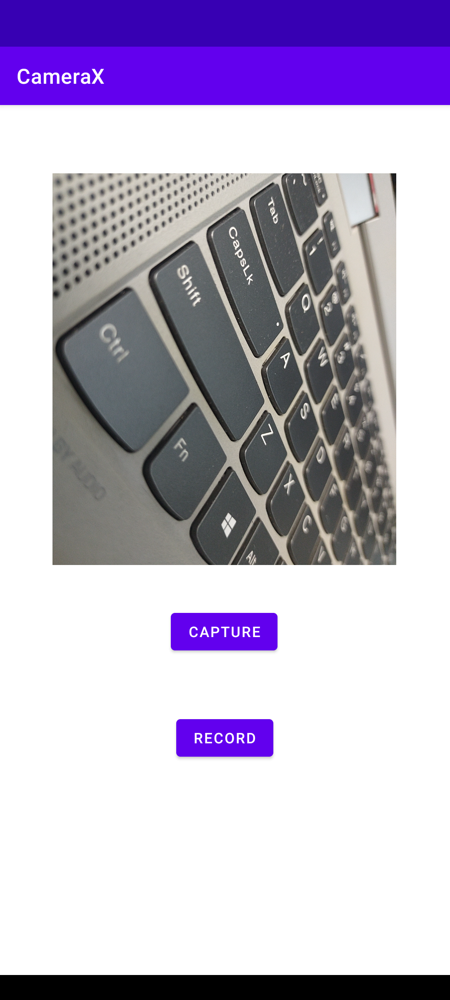

# CameraX-In-Java
Implementation of CameraX In Java.

### Tutorial
This project is a reference code made for the video 'Camera X in Java | Image Capture, Video Capture, Image Analysis'.

Link: https://youtu.be/IrwhjDtpIU0

## Getting Started

These instructions will get you a copy of the project up and running on your local machine.

### Prerequisites

The things you need before installing the software.

* Android Studio

## Installation
Clone this repository and import into **Android Studio**
```bash
git clone https://github.com/farazxsiddiqui/CameraX.git
```

## Configuration
### Gradle Dependencies:
```
dependencies {
    def cameraxVersion = "1.1.0-alpha05"
    implementation "androidx.camera:camera-core:${cameraxVersion}"
    implementation "androidx.camera:camera-camera2:${cameraxVersion}"
    implementation "androidx.camera:camera-lifecycle:${cameraxVersion}"

    // CameraX View class
    implementation 'androidx.camera:camera-view:1.0.0-alpha25'
    }

```
### Permissions:
First enable permissions from the app info in device settings.

```
* Camera
* Microphone
* Read/Write External Storage
```
```
### Image:
```
<table>
  <tr>
  <td></td>
  </td>
 </table>
